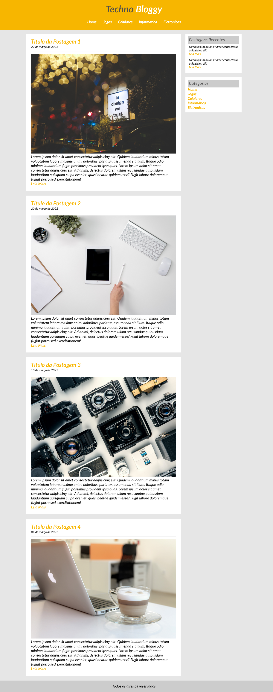

# Projeto 3 = Curso Desenvolvimento Web Completo 

Projeto Tech Blog.

Objetivo do projeto: dominio de padding,margin , float para composição de layouts, Elementos inline, block, inline block. 
Posicionamentos e formatação de links.

Mudanças: 
Nome do Blog: Techno Bloggy
Imagens: Pexels banco de imagens gratuitas.
autores:alex andrews, anton atanasov, cottonbro, kaboompics.

Layout final.
